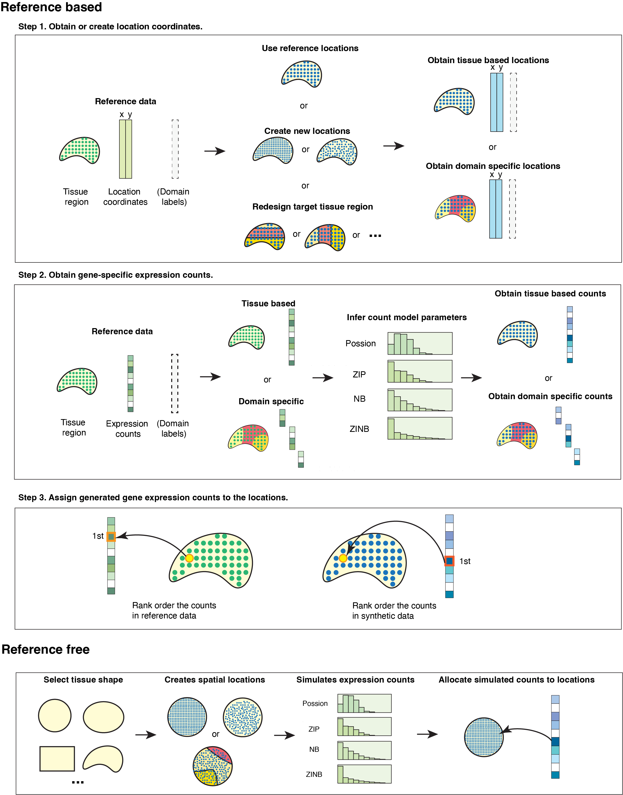

---
#
# By default, content added below the "---" mark will appear in the home page
# between the top bar and the list of recent posts.
# To change the home page layout, edit the _layouts/home.html file.
# See: https://jekyllrb.com/docs/themes/#overriding-theme-defaults
#
layout: home
author: "Jiaqiang Zhu, Lulu Shang and Xiang Zhou"
date: '2022-06-10'
fontsize: 10pt
linkcolor: blue
mainfont: Times
output:
pdf_document: default
html_document: default
md_document:
variant: markdown_github
---

**SRTsim** is an independent, reproducible, and flexible SRT simulation framework that can be used to facilitate the development of SRT analytical methods for a wide variety of SRT-specific analyses. It utilizes spatial localization information to simulate SRT expression count data in a reproducible and scalable fashion. Two major simulation schemes are implemented in SRTsim: reference-based and reference-free. 

**Reference-Based Simulation Example **:[here](https://xzhoulab.github.io/SPARK/02_SPARK_Example/).
