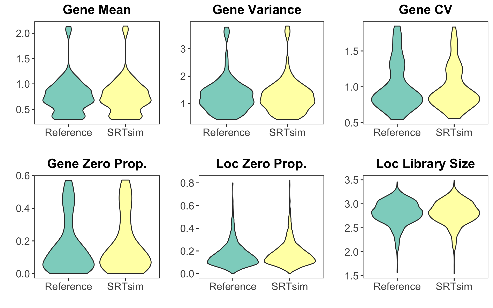
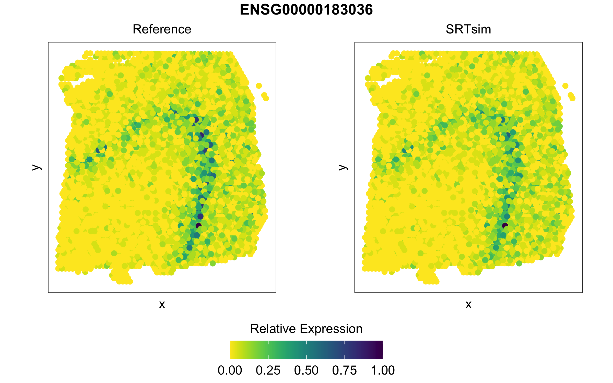
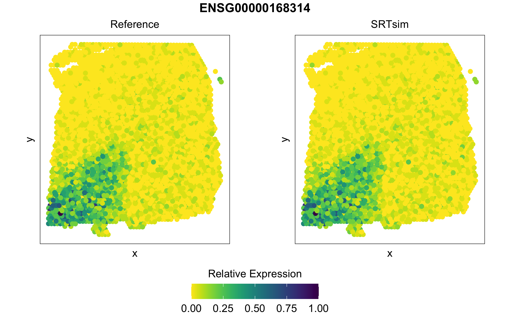

#### Get Started 

To get started, please load the `SRTsim` package.

```R
library('SRTsim')
```
Once you have loaded the package, we can perform reference-based simulation with the example data.

#### Explore example SRT data 
```R
str(exampleLIBD)
# List of 2
#  $ count:Formal class 'dgCMatrix' [package "Matrix"] with 6 slots
#   .. ..@ i       : int [1:241030] 1 2 8 9 10 11 13 14 15 16 ...
#   .. ..@ p       : int [1:3612] 0 67 122 182 252 322 392 462 534 609 ...
#   .. ..@ Dim     : int [1:2] 80 3611
#   .. ..@ Dimnames:List of 2
#   .. .. ..$ : chr [1:80] "ENSG00000175130" "ENSG00000159176" "ENSG00000168314" "ENSG00000080822" ...
#   .. .. ..$ : chr [1:3611] "AAACAAGTATCTCCCA-1" "AAACAATCTACTAGCA-1" "AAACACCAATAACTGC-1" "AAACAGAGCGACTCCT-1" ...
#   .. ..@ x       : num [1:241030] 1 1 1 7 10 1 5 2 1 1 ...
#   .. ..@ factors : list()
#  $ info :'data.frame':  3611 obs. of  6 variables:
#   ..$ row     : int [1:3611] 50 3 59 14 43 47 73 61 45 42 ...
#   ..$ col     : int [1:3611] 102 43 19 94 9 13 43 97 115 28 ...
#   ..$ imagerow: num [1:3611] 381 126 428 187 341 ...
#   ..$ imagecol: num [1:3611] 441 260 183 417 153 ...
#   ..$ tissue  : Factor w/ 2 levels "0","1": 2 2 2 2 2 2 2 2 2 2 ...
#   ..$ layer   : chr [1:3611] "Layer3" "Layer1" "WM" "Layer3" ...
example_count   <- exampleLIBD$count
example_loc     <- exampleLIBD$info[,c("imagecol","imagerow","layer")]
colnames(example_loc) <- c("x","y","label")
```

#### Create a SRT object
```R   
simSRT  <- createSRT(count_in=example_count,loc_in =example_loc)
simSRT
# class: simSRT 
# Reference name: ref1 
# Reference dim: 80 3611 
# Reference rownames(80): ENSG00000175130 ENSG00000159176 ...
#   ENSG00000198712 ENSG00000198938
# Reference colnames(3611): AAACAAGTATCTCCCA-1 AAACAATCTACTAGCA-1 ...
#   TTGTTTGTATTACACG-1 TTGTTTGTGTAAATTC-1
# refcolData names(3): x y label
```

#### Tissue-wise simulation: Model fitting and data simulation
```R 
## Set a seed for reproducible simulation
set.seed(1)

## Estimate model parameters for data generation
simSRT1 <- srtsim_fit(simSRT,sim_schem="tissue")

## Generate synthetic data with estimated parameters
simSRT1 <- srtsim_count(simSRT1)
```

#### Domain-Specific simulation: Model fitting and data simulation
```R 
## Set a seed for reproducible simulation
set.seed(1)
## Estimate model parameters for data generation
simSRT2 <- srtsim_fit(simSRT,sim_schem="domain")
## Generate synthetic data with estimated parameters
simSRT2 <- srtsim_count(simSRT2)
```

#### Explore the synthetic data
```R 
simCounts(simSRT1)[1:3,1:3]
# 3 x 3 sparse Matrix of class "dgCMatrix"
#                 AAACAAGTATCTCCCA-1 AAACAATCTACTAGCA-1 AAACACCAATAACTGC-1
# ENSG00000175130                  .                  .                 10
# ENSG00000159176                  1                  3                  5
# ENSG00000168314                  1                  .                  6
```

#### Comparison Between Reference Data and Synthetic Data
After data generation, we can compare metrics of reference data and synthetic data
```R 
## Compute metrics 
simSRT1   <- compareSRT(simSRT1)
## Visualize Metrics
visualize_metrics(simSRT1)
```


We can compare the expression patterns for genes of interest
```R 
visualize_gene(simsrt=simSRT1,plotgn = "ENSG00000183036",rev_y=TRUE)
```


```R 
visualize_gene(simsrt=simSRT2,plotgn = "ENSG00000168314",rev_y=TRUE)
```

