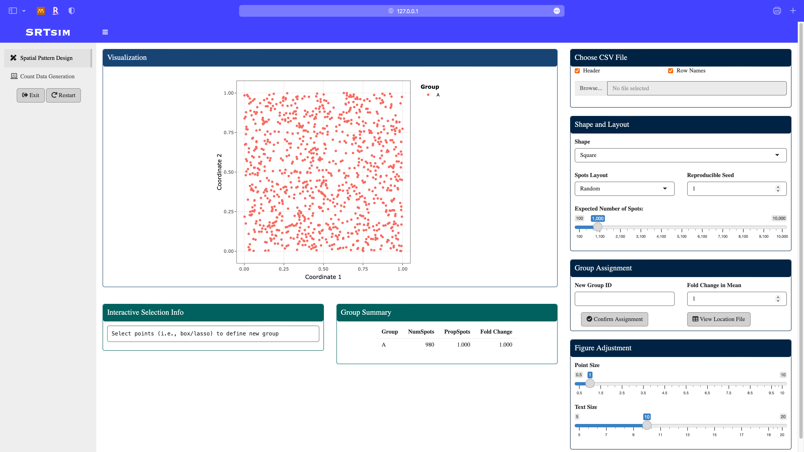
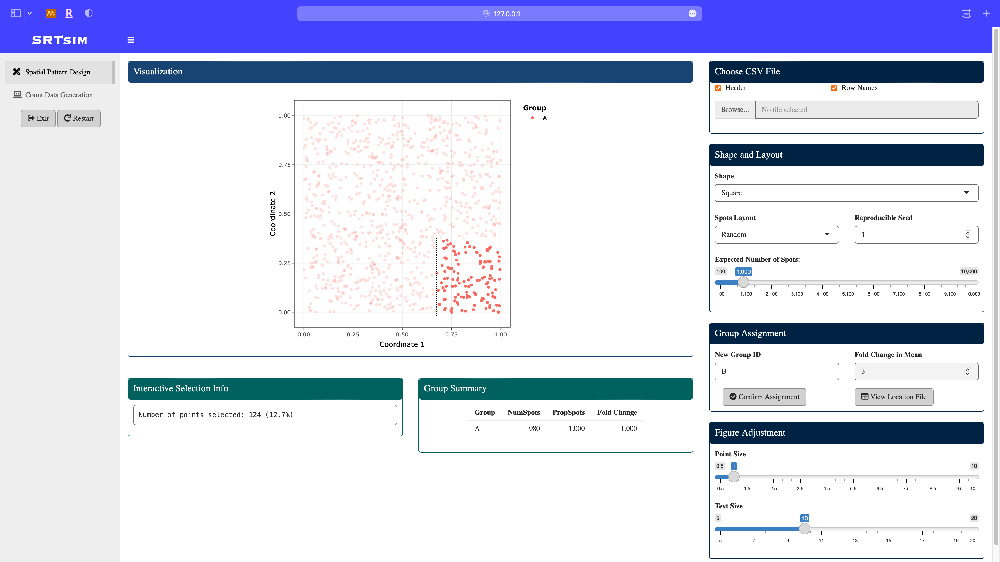
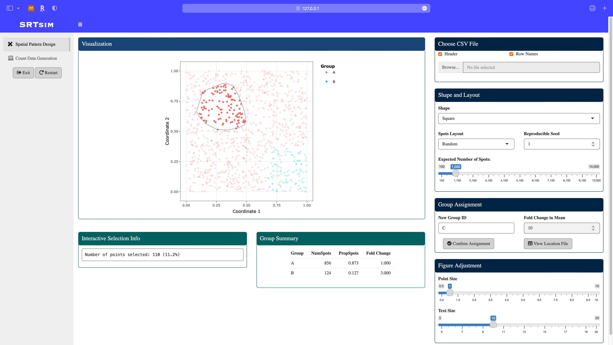
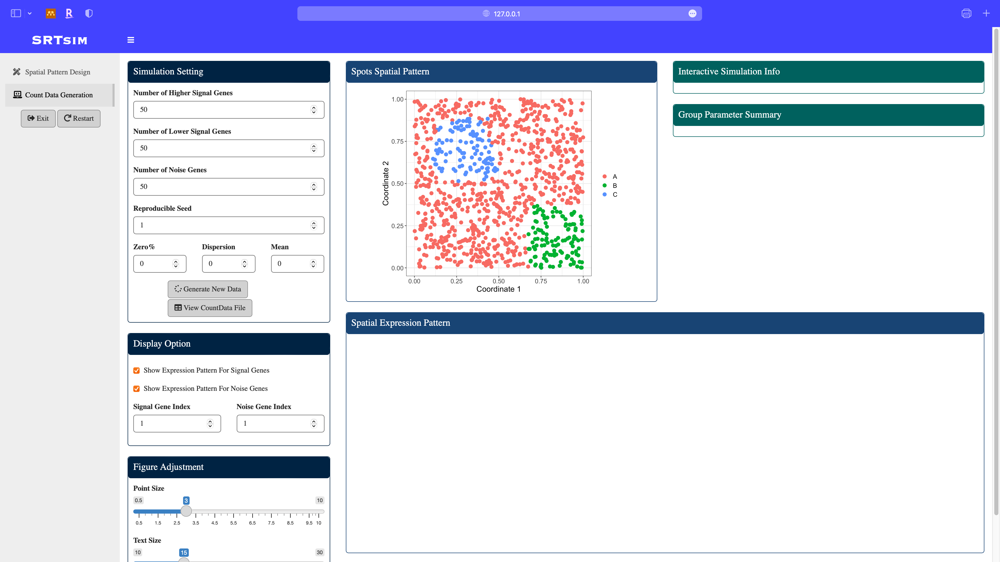
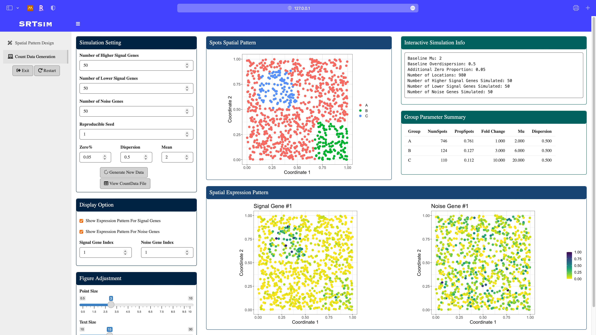

### Get Started 

To get started, please load the `SRTsim` package.

```R
library('SRTsim')
# Loading required package: shiny
# Listening on http://127.0.0.1:4218
```

### Activate the shiny app
```R
shinySRT1 <- SRTsim_shiny()
```

### Design Spatial Pattern
**Start Page**: In this example, we selected the *square* shape, *random* location layout, *1000* spatial locations. 


**Define a new group B**: using the *box select* module in the *plotly*, assign the fold change in this group to be 3. Note that the *group summary* is updated.


**Define a new group C**: using the *lasso select* module in the *plotly*, assign the fold change in this group to be 10. Note that the *group summary* is updated.



### Count Data Generation
Once we done the pattern design, click the count data generation module in the sidebar. The designed pattern is displayed in the middle. 


**Specify model parameters for the count data generation**: here we consider a zero-inflated negative binomial model with *zero proportion* to be 0.05, *dispersion* to be 0.5, and *mean* to be 2. After parameter specification, click the *Generate New Data* button. All the panels will be updated and spatial expresion patterns of signal and noise genes will be displayed. 



### Quit the Shiny App
Click exit button in the sidebar, the browser window will be closed. 

### Convert Shiny Output to SRTsim Class
```R
simSRT1 <- Shiny2SRT(shinySRT1)
simSRT1@simCounts[1:5,1:5]

# 5 x 5 sparse Matrix of class "dgCMatrix"
#         Loc1 Loc2 Loc3 Loc4 Loc5
# signal1    .    .    6    .    2
# signal2    .    1    4    2    3
# signal3    1    1    1    .    1
# signal4    5    1    3    .    1
# signal5    .    1    2    .    3
```

### Reproduce Count Data with Parameter Stored in the Object
```R
newCT1  <- reGenCountshiny(simSRT1)
newCT1[1:5,1:5]

#         Loc1 Loc2 Loc3 Loc4 Loc5
# signal1    0    0    6    0    2
# signal2    0    1    4    2    3
# signal3    1    1    1    0    1
# signal4    5    1    3    0    1
# signal5    0    1    2    0    3
```


